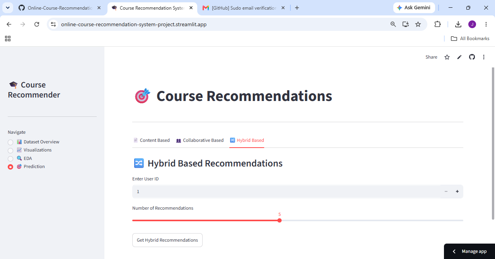

# 🎯 Online Course Recommendation System

A web app that recommends online courses to users using **Content-Based**, **Collaborative**, and **Hybrid** recommendation approaches — built with Python and deployed using Streamlit.

🔗 **Live Demo:** [online-course-recommendation-system-project.streamlit.app](https://online-course-recommendation-system-project.streamlit.app)

---

## 📌 Overview

This project recommends online courses to users based on their preferences and behavior, using multiple recommendation strategies:

- **Content-Based Filtering** — recommends courses similar to a selected course based on course content/features
- **Collaborative Filtering** — recommends courses based on patterns from other users with similar interests
- **Hybrid Approach** — combines both methods for more robust recommendations

The app also includes a **Dataset Overview**, **Exploratory Data Analysis (EDA)**, and **Visualizations** section to explore the underlying course data.

---

## ✨ Features

- 📊 Dataset Overview — explore the raw course dataset
- 📈 Visualizations — visual insights into course trends and patterns
- 🔍 EDA — exploratory data analysis of the dataset
- 🎯 Prediction — get personalized course recommendations via:
  - Content-Based tab
  - Collaborative-Based tab
  - Hybrid-Based tab
- 🎚️ Adjustable difficulty level and number of recommendations

---

## 🛠️ Tech Stack

- **Python**
- **Streamlit** — web app framework & deployment
- **Pandas / NumPy** — data handling
- **Scikit-learn** — similarity computation / ML logic
- **Matplotlib** — data visualization
- **Joblib** — model/data serialization (`.pkl` files)

---

## 📂 Project Structure

```
Project3/
│
├── deployment.py              # Main Streamlit app (entry point)
├── requirements.txt           # Python dependencies
│
├── content_sim.pkl            # Precomputed content similarity matrix
├── user_course_matrix.pkl     # User-course interaction matrix
├── course_catalog.pkl         # Course catalog data
├── df.pkl                     # Main processed dataset
│
├── app.py / app.ipynb         # Model development / experimentation notebooks
├── Training.ipynb             # Model training notebook
├── Practice.ipynb             # Exploratory/practice notebook
│
└── online_course_recommendation.xlsx   # Raw dataset
```

---

## 🚀 Running Locally

1. Clone the repository:
   ```bash
   git clone https://github.com/Jidhin71/Online-Course-Recommendation-System-Project.git
   cd Online-Course-Recommendation-System-Project
   ```

2. Install dependencies:
   ```bash
   pip install -r requirements.txt
   ```

3. Run the Streamlit app:
   ```bash
   streamlit run deployment.py
   ```

4. Open the local URL shown in your terminal (usually `http://localhost:8501`).

---

## 🌐 Deployment

This app is deployed on **[Streamlit Community Cloud](https://share.streamlit.io)**, connected directly to this GitHub repository.

Live app: **[online-course-recommendation-system-project.streamlit.app](https://online-course-recommendation-system-project.streamlit.app)**

---

## 📸 Screenshot

*(Add a screenshot of the app here — drag an image into the README on GitHub, or use the syntax below once uploaded)*

```markdown

```

---

## 👤 Author

**Jidhin**
GitHub: [@Jidhin71](https://github.com/Jidhin71)

---

## 📄 License

This project is open-source. Feel free to use and modify it for learning purposes.
